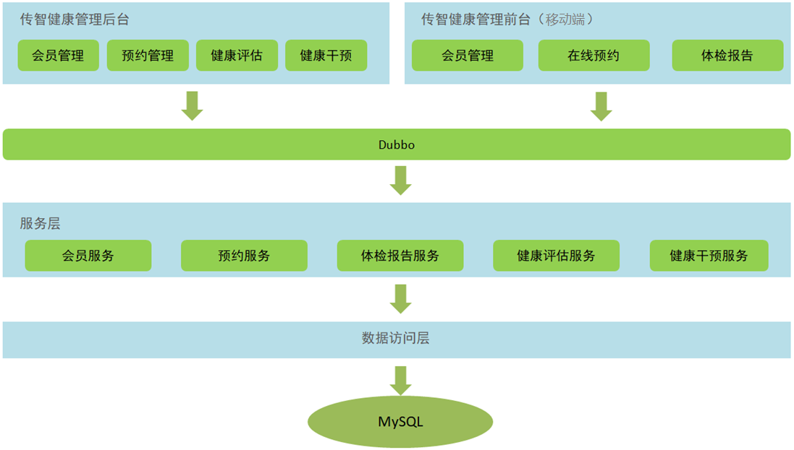

# 健康医疗

#### 介绍

1.  该项目为黑马程序员的《传智健康》的项目。
2.  完善了其中缺少的部分。在短信发送验证码使用发送邮件代替。
3.  技术栈：SSM+zookeeper+dubbo+redis+七牛云服务+小程序。
4.  分布式服务架构，无集群。
5.  采用瀑布模型进行开发。
6.  后面可能使用UML将该项目整理一下（用例图等）。

#### 软件架构
软件架构说明

#### 功能架构

#### 项目结构

各模块职责定位：

health_parent：父工程，打包方式为pom。统一锁定依赖的版本、聚合其他子模块。
。
health_common：通用模块，打包方式为jar。存放项目中使用到的一些工具类、实体类、返回结果和常量类。

health_interface：打包方式为jar，存放服务接口。

health_service_provider：Dubbo服务模块，打包方式为war。存放服务实现类、Dao接口、Mapper映射文件等，作为服务提供方，需要部署到服务器运行（该项目使用tomcat服务器）。

health_backend：传智健康管理后台，打包方式为war。作为Dubbo服务消费方，存放Controller、HTML页面、js、css、spring配置文件等，需要部署到服务器运行（该项目使用tomcat服务器）。

health_mobile：移动端前台，打包方式为war。作为Dubbo服务消费方，存放Controller、HTML页面、js、css、spring配置文件等，需要部署到服务器运行（该项目使用tomcat服务器）。
#### 安装教程

1.  修改dubbbo、zookeeper、数据库的配置。
2.  因为采用的S分布式服务架构，所以要想消费者正常运行，服务提供者必须在部署在服务器上。

#### 使用说明

1.  暂无

#### 参与贡献

1.  Fork 本仓库
2.  新建 Feat_xxx 分支
3.  提交代码
4.  新建 Pull Request

#### 特技

1.  使用 Readme\_XXX.md 来支持不同的语言，例如 Readme\_en.md, Readme\_zh.md
2.  Gitee 官方博客 [blog.gitee.com](https://blog.gitee.com)
3.  你可以 [https://gitee.com/explore](https://gitee.com/explore) 这个地址来了解 Gitee 上的优秀开源项目
4.  [GVP](https://gitee.com/gvp) 全称是 Gitee 最有价值开源项目，是综合评定出的优秀开源项目
5.  Gitee 官方提供的使用手册 [https://gitee.com/help](https://gitee.com/help)
6.  Gitee 封面人物是一档用来展示 Gitee 会员风采的栏目 [https://gitee.com/gitee-stars/](https://gitee.com/gitee-stars/)
